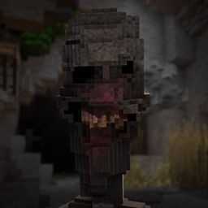

  

<h1 align="center">Terminus Russian Localization</h1>

  Unofficial Russian translation and glitch voiceover for the story-driven horror mod <b>Terminus</b>.

  <a href="https://www.curseforge.com/minecraft/mc-mods/terminus-horror">Original Mod</a>
  ·
  <a href="https://www.curseforge.com/minecraft/mc-mods/geckolib">GeckoLib</a>
  ·
  <a href="#installation">Installation</a>
  ·
  <a href="#русский">Русский</a>

  
  
  
  

---

## English

This is an unofficial Russian localization for the story-driven horror mod **Terminus**. It translates in-game text and adds synthetic Russian voice lines while keeping the uneasy tone of the original: broken messages, interference, strange repetition, and the feeling that the system is not telling you everything.

The original Terminus mod is required. This project is a fan localization, not a standalone mod and not an official release.

For the original mod description, screenshots, files, and author page, open the official CurseForge project:

[Terminus [Horror] on CurseForge](https://www.curseforge.com/minecraft/mc-mods/terminus-horror)

## Download

Download the ready resource pack from this repository:

[Terminus_RU_ResourcePack_1.0.zip](Terminus_RU_ResourcePack_1.0.zip)

## What Is Included

- Russian translation for interface text, subtitles, names, and story messages.
- Russian voice lines for spoken phrases.
- Horror-style voice processing with noise, glitches, radio effect, and distortion.
- Meaning-focused translation that keeps the intent of the original lines.

Gameplay mechanics, balance, mobs, world generation, and music are not changed. This is a localization, not a gameplay overhaul.

## Installation

1. Install the original **Terminus** mod.
2. Install the dependencies required by the original mod.
3. Put `Terminus_RU_ResourcePack_1.0.zip` into the `resourcepacks` folder.
4. Enable the pack above other packs that may modify Terminus.
5. Select Russian in the game language settings.

## Important

This localization is not affiliated with the original Terminus project. All rights to the original mod, its concept, code, assets, sounds, and characters belong to the original author.

The Russian voiceover is synthetic. It is not a live actor recording and does not clone the voice of the author or any other person.

## Content Warning

Terminus uses horror atmosphere, sudden sounds, unsettling messages, visual glitches, and dark story elements. If you are sensitive to this kind of content, play carefully.

## Credits

Original mod: **Terminus [Horror]**.

Russian localization: fan translation for Russian-speaking players.

---

## Русский

Неофициальный русский перевод для сюжетного хоррор-мода **Terminus**. Пакет переводит игровые тексты и добавляет русскую синтетическую озвучку, сохраняя тревожный тон оригинала: обрывки сообщений, помехи, странные повторы и ощущение, что система говорит не всё.

Для работы нужен оригинальный Terminus. Это фанатская локализация, а не самостоятельный мод и не официальный релиз.

Официальная страница оригинального мода:

[Terminus [Horror] на CurseForge](https://www.curseforge.com/minecraft/mc-mods/terminus-horror)

## Скачать

Готовый ресурспак лежит в этом репозитории:

[Terminus_RU_ResourcePack_1.0.zip](Terminus_RU_ResourcePack_1.0.zip)

## Перевод Описания Оригинала

Добро пожаловать во Фрейлендс. Лучшее место для побега от всего... но только днём. Ночью лучше не попадаться ЕМУ на глаза.

Чтобы попасть в этот странный мир, после появления в обычном мире идите к координатам `(0, 0)`. Там всегда стоит необычная структура. Внутри спрятан старый, заросший командный блок, который переносит игрока в пространство между обычным миром и границей мира. Это Фрейлендс: место кажется уютным и почти добрым, пока не наступает ночь. Тогда приходит туман, и вместе с ним выходит ОН.

Что есть в моде:

- **ОН** — существо, которое живёт в некогда мягких Фрейлендс и уже подчинило их себе.
- **Туман** — запустение, меняющее всю атмосферу мира. Здесь больше небезопасно, а мир следит за вашим шумом.
- **ЕГО рука** — тянется из темноты и может схватить игрока, но любую хватку можно сорвать.
- **Шаги** — в тумане слышно, как что-то тяжёлое ходит кругами.
- **Шум** — бег, удары, двери и падения заполняют шкалу на экране. Слишком много шума призывает ЕГО.
- **Глаза** — единственные животные, оставшиеся в этом месте. Или всё-таки нет?
- **Бледная фигура** — бывший житель этих земель, иногда появляющийся на горизонте.
- **Сломанные звери** — существа без частей тела, движущиеся резкими судорогами.
- **Пещеры** — темнее обычных; иногда в воздухе проходит тёмная дымка.
- **Диктор** — странная сущность, которая комментирует действия игрока и даёт советы.

Оригинальный мод был заказан NotVixios.

## Что Внутри

- русский перевод интерфейса, субтитров, названий и сюжетных сообщений;
- русская озвучка речевых фраз;
- обработка голоса под атмосферу хоррора: шум, гличи, радио-эффект и искажения;
- сохранённый смысл оригинальных реплик без пересказа «своими словами».

Игровые механики, баланс, мобы, генерация мира и музыка не меняются. Это локализация, а не переработка мода.

## Установка

1. Установите оригинальный **Terminus**.
2. Установите все зависимости, которые требует оригинальный мод.
3. Поместите `Terminus_RU_ResourcePack_1.0.zip` в папку `resourcepacks`.
4. Включите ресурспак выше других пакетов, которые могут менять Terminus.
5. Включите русский язык в настройках игры.

## Важно

Локализация не относится к официальному проекту Terminus. Все права на оригинальный мод, его идею, код, ассеты, звуки и персонажей принадлежат автору оригинала.

Русская озвучка синтетическая. Она не является записью живого актёра и не копирует голос автора или других людей.

## Предупреждение

Terminus использует хоррор-атмосферу, резкие звуки, тревожные сообщения, визуальные помехи и мрачные сюжетные элементы. Если вы чувствительны к таким вещам, играйте осторожно.

## Благодарности

Оригинальный мод: **Terminus [Horror]**.

Русская локализация: фанатский перевод для русскоязычных игроков.
